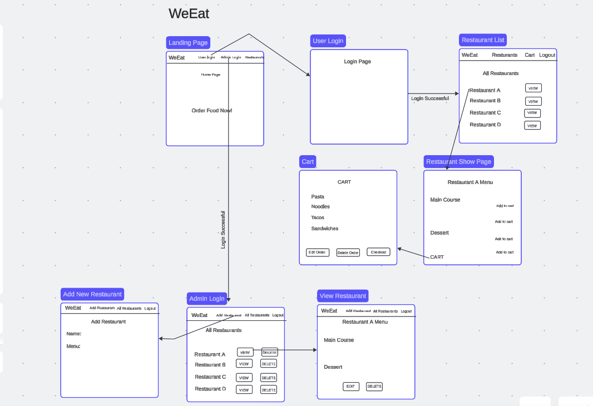
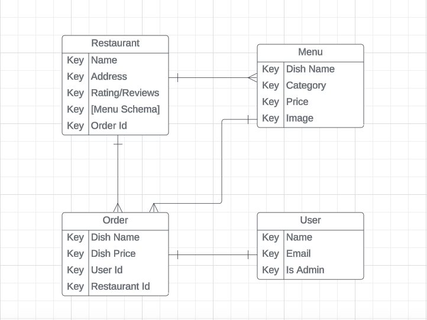
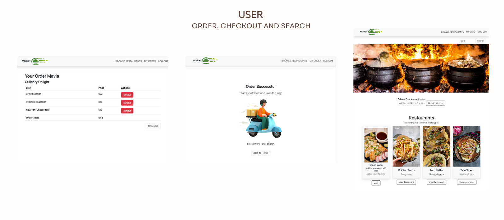
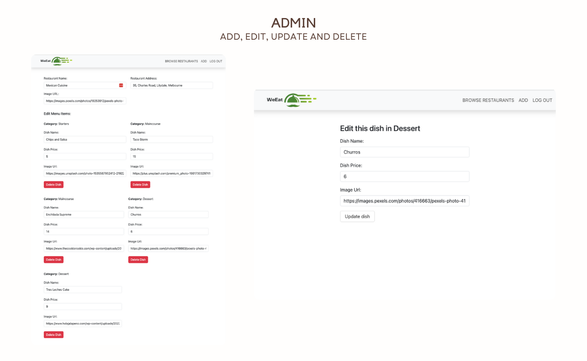

# 🍲 WeEat Food Delivery App 🍲

### 🍗 Introduction

Introducing WeEat, a robust full-stack food delivery app meticulously crafted with HTML, CSS, Bootstrap, JavaScript, Node.js, Express, MongoDB, Mongoose, EJS, OAuth, Passport and external Apis. Embracing full CRUD functionality and RESTful routes, WeEat ensures a seamless and delightful user experience for discovering, ordering, and savoring culinary delights

### 🔎 Explore My App

Discover the refined version of my [WeEat food delivery App](https://weeat-t9e5.onrender.com/) now live on render.

Admin Credentials: email: weeat.fooddelivery@gmail.com password: weeatfood

### 🧩 App Functionality

Explore my app's easy-to-use features, including dynamic restaurant exploration, menu customization, and an efficient order management system, redefining the user experience

### 📲 All Restaurants Page

-   Any visitor can view a list of All restaurants and search for a restaurant or dish
-   An Admin can see the options of 'View, 'Add', 'Edit' and 'Delete' for each restaurant.
-   A user can only see the 'View' option to check out that particular restaurant
-   A user is also able to see delivery times for each restaurant to their address when they input their address in the form

#### 👉 Single Restaurant Page

-   Any visitor can see Restaurant location on the map, it's menu items and respective prices.
-   An admin is able to 'Add', 'Edit, 'Delete' a restaurant as well as its menu (including individual menu items)
-   A user is able to calculate delivery time from that particular restaurant to their address.
-   A user can Add items to their order

#### 👉 Order Page

-   A user is able to navigate to their order page and view a list of the menu items they added to their order.
-   A user is able to delete each menu item from their order.
-   A user is able to see the real time total of their order and can proceed to checkout.
-   A user is able to see a fake checkout page

### 📝 Wireframes and ERD

### 📷 App Screenshots

#### 📲 App Homepage

💻 Not Logged In

👩🏻‍💻 Admin

🧑🏾‍💻 User

#### 📲 All Restaurants

💻 Not Logged In

👩🏻‍💻 Admin

🧑🏾‍💻 User

#### 📲 Show Restaurants

💻 Not Logged in

👩🏻‍💻 Admin

🧑🏾‍💻 User

⏩ Other Pages

### 🤖 Technologies Used

-   HTML
-   CSS
-   Bootstrap
-   JavaScript
-   Mongo DB
-   Mongoose
-   ExpressJS
-   Node.js
-   EJS
-   OAuth
-   Passport
-   Google Maps Api
-   Distance Matrix Api

### 😔 Challenges Faced and Conquered 😃

There were many challenges at every step of the way but the honorable mentions are:

-   Handeling Menu Schema and creating CRUD functionality for each menu item.
-   Implementing Search functionality for menu items as I had to do a lot of research and used MongoDB aggregation framework to $unwind the 'menu'array in each restaurant, converting it into separate document, then $match the menu items based on search query and finally $project the desired fields for the result
-   Implementing Distance Matrix Api to calculate the distance between the user address and the restaurant address

### 🚀 Next Steps

-   Limit the user from adding duplicate dishes to the menu
-   Displaying the quantity of each dish user adds to their order.
